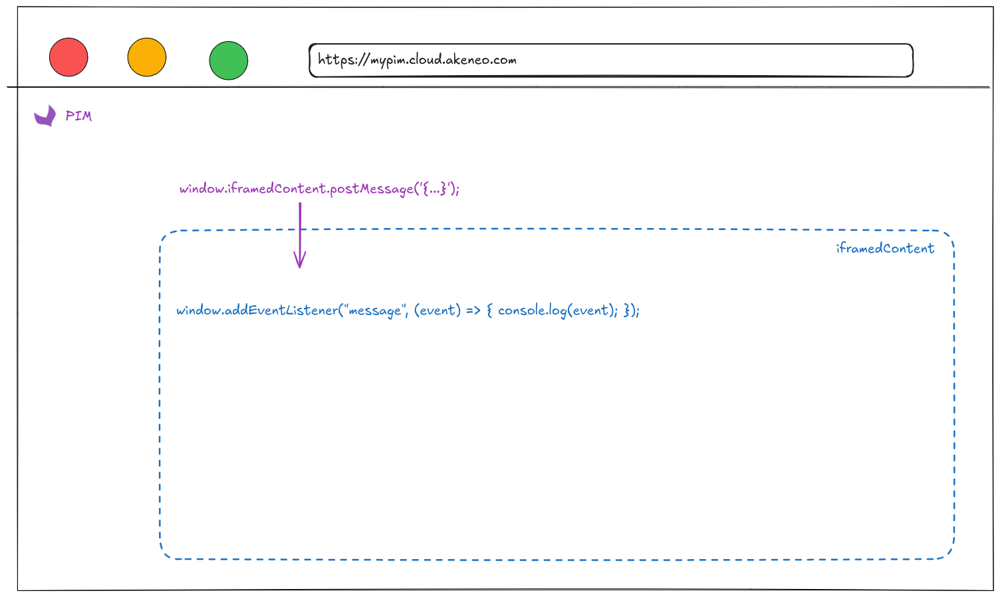

# UI Extension samples

## Prerequisites: BETA stage

We would like to inform you that this feature is currently in its <b>BETA</b> stage. As part of the ongoing development process, method names, parameter names, and other aspects of the functionality may be subject to change. We are continually working to improve and refine the feature.
Please be aware that updates or modifications may occur without prior notice as we aim to enhance stability, performance, and usability.
Thank you for your understanding and collaboration during this phase.

## UI Extensions types

- `simple_iframe` (will become `iframe`)
  - On click: load content of an external website in several places in the PIM with contextualized information (scope/locale/user/product). Embedded as an iFrame
- `simple_button` (will become `open`)
  - On click: open a new tab within the user's browser
- `action` (soon to be released)
  - On click: our backend service will call the configured url with a POST method. The body of this HTTP request will contain contextualized information (scope/locale/user/product)

# API documentation

The [openapi specification](./api/openapi.yaml) describe how to use this API.

The prefered way of testing out this API is by using the [Postman Collection](./api/generated/generated_postman_collection.json)
Import the collection and the [postman environment template](./api/postman/postman_environment_template.json) into postman, then fill the environment variable.

# Enhanced context

## Using `action` or `iframe` type

By using `action` or `iframe` type you'll be able to run your business logic based on contextual information:
- Who is the user triggering the action or opening the iframe
- In which locale / channel he/she is navigating
- On which product(s) the action or the iframe is requested


```json
{
  "data": {
    //In case of an action from the product grid
    "products": {
      "product_uuids": ["abc-123", "abc-456", "abc-789"],
      "product_model_codes": ["x", "y", "z"],
    },

    //In case of an action from the PEF
    "product": {
      "product_uuid": "abc-123"
    }
  },
  "context": {
      "locale": "en_US",
      "channel": "ecommerce",
  },
  "user": {
      "username": "julia",
      "groups": ["redactor", "marketing", "IT"]
  }
}
```

## Query parameters placeholders

You can ask for specific values to construct the urls thanks to a specific placeholder pattern. Let's take an example:

You want to configure a `simple_button` to open Google Shopping with a search filtered on the product you're on by it's name.

You can configure a UI Extension with the following url `https://www.google.com/search?q=%name%&tbm=shop&gl=us`, then we will dynamically put the value of the attribute code `name` when the user will click on the simple button.

Valid placeholders attributes are:
- attribute of type: `identifier` & `text` only
- non scopable
- non localizable

You can add a placeholder anywhere in your url as soon as they're surrounded by `%` symbol.
Examples:
- `https://www.google.com/search?q=%name%`
- `https://yourwebsite.com/%sku%`

## The parameters accessible by the iFrame

When loading an iframe, several parameters are sent by default as SearchParameters in a GET query, so the server knows who is the connected user (insecure) and in which context the iframe is opened.

For example, when `url` is `https://customerwebsite.com/iframe/`, the called URL is `https://customerwebite.com/iframe/?paramA=valueA&paramB=valueB`

For all positions except `pim.product-grid.action-bar`, parameters relative to the connected user are sent:
- `user[catalog_locale]`
- `user[catalog_scope]`
- `user[ui_locale]`
- `user[username]`
- `user[email]`

For `pim.product.tab` position, these parameters are sent:
- `product[uuid]`
- `product[identifier]`

For `pim.category.tab` position, this parameter is sent:
- `category[code]`

## The specificities of the grid quick action

For `pim.product-grid.action-bar` position, an object is sent by the parent to the iframe with a [postMessage JS event](https://developer.mozilla.org/en-US/docs/Web/API/Window/postMessage):

The following data is subject to change, we will make it evolve and should perceived as an "API contract" between the PIM and the system listening to those events. (DEPRECATION NOTICE: this format will not be supported by the end of february 2025, we will soon communicate on the new format. We'll send you a list of product uuid or product model codes directly instead of a search query. This list will be limited to a certain number of products, hence the action will not be possible if the number of selected product is greater than 500 products).
```json
{
  "filters": {
    "productFilters": {
      "uuid": [
        {
          "operator": "IN",
          "value": [
            "90faabea-83ce-4f0a-85e4-9832abc565d6"
          ]
        }
      ]
    },
    "productModelFilters": []
  },
  "itemsCount": 1,
  "context": {
    "locale": "en_US",
    "scope": "ecommerce"
  }
}
```
